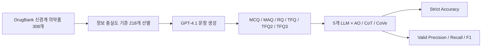

# Pharma LLM Evaluation

**의약품 도메인에서 모델·프롬프트·문항 구조가 LLM 응답 정확도에 미치는 영향을 평가한 연구입니다.**

DrugBank 기반 벤치마크를 구축하고 **5개 모델 × 3개 프롬프트 × 6개 문항 유형 × 100문항**의 90개 조건, 총 9,000개 응답을 비교했습니다. 데이터 정제부터 문항 생성, 모델 추론, 응답 평가까지의 연구 코드를 정리했습니다.

- 연구 기간: 2025.07–2025.11
- 연구자: 오승은
- 성과: **2025 디지털 바이오헬스 종합설계 경진대회 심사위원상**
- 기술: Python, OpenAI API, LangChain, PyTorch, Hugging Face Transformers, pandas, scikit-learn

## 핵심 결과

| 비교 | 연구에서 보고한 결과 |
|---|---:|
| Answer-only 평균 정확도 | 75.80% |
| Chain-of-Thought 평균 정확도 | 82.17% |
| Chain-of-Verification 평균 정확도 | 81.50% |
| CoT − Answer-only | **+6.37%p** |
| GPT-4o 평균 정확도 | **91.00%** |
| 임상 맥락 TFQ2 − 일반 TFQ | **+14.53%p** |

CoT는 AO보다 높은 정확도를 보였지만, CoVe의 추가 검증은 평균적으로 CoT를 넘지 못했습니다. 의료 특화 튜닝 여부만으로 성능을 예측하기 어려웠으며, 문항 유형에 따라 성능 차이가 컸습니다. TFQ와 TFQ2는 서로 다른 문항 집합이므로 14.53%p 차이를 임상 맥락만의 인과 효과로 단정하지 않습니다.

수치는 연구 당시 최종 Notion 기록과 `accuracy_analysis.ipynb`의 저장된 출력에서 교차 확인했습니다. 이번 저장소 정리 과정에서 9,000개 응답을 다시 생성하거나 원본 Excel 응답을 재평가하지 않았습니다. [전체 집계 수치](reports/reported_summary.csv) · [검증 범위](docs/VALIDATION.md)

## 연구 흐름



### 데이터와 문항 설계

약물명·설명·작용기전·약력학·적응증·영향 생물체·독성의 7개 필드 중 약물명을 포함해 최소 5개 필드가 채워진 218개 의약품을 선별했습니다. 2,180개 MCQ 중 부적절한 텍스트가 포함된 5개를 제외해 2,175개를 확보하고, 변환 실패 153개를 제외한 2,022개를 대체 문항 유형 구성에 활용했습니다.

| 유형 | 평가하는 능력 | 설계 |
|---|---|---|
| MCQ | 단일 정답 선택 | 4지선다 |
| MAQ | 복수 정답 선택 | 긍정·부정 질문, 다중 선지 |
| RQ | 타인의 답 검토와 정답 제시 | 정오 판단 + 선지 선택 |
| TFQ | 의약품 진술의 참·거짓 판단 | 긍정·부정 진술 |
| TFQ2 | 임상 상황에서의 참·거짓 판단 | 병력·병용 약물 등 맥락 추가 |
| TFQ3 | 처방과 근거의 적절성 판단 | 임상 시나리오 기반 |

MCQ·MAQ·RQ·TFQ 구성에는 MultifacetEval을 참고했고, TFQ2·TFQ3를 추가 설계했습니다. [기존 코드와의 관계](THIRD_PARTY_NOTICES.md)

### 실험 조건과 평가

- 범용 모델: GPT-4o, GPT-5, GPT-4o-mini
- 의료 특화 모델: AdaptLLM/medicine-chat (7B, 8-bit), m42-health/Llama3-Med42-70B (4-bit)
- 프롬프트: Answer-only, Chain-of-Thought, Chain-of-Verification
- Strict Accuracy: 형식 오류를 포함한 전체 응답 기준. MAQ·RQ는 모든 요소가 맞아야 정답.
- Valid Metrics: 파서가 유효하다고 판단한 응답에서 Precision·Recall·F1 계산. MAQ는 선지별 이진 분류, RQ는 판단과 선지 선택을 분리.

유효 응답 성능도 파싱 규칙과 표본 선택의 영향을 받으므로 순수 지식 능력 자체를 직접 측정하는 지표는 아닙니다. 원래 파서는 일부 응답에서 느슨한 문자 매칭을 사용합니다. [재현 시 주의점](docs/REPRODUCTION.md)

## 코드 구성

| 폴더 | 내용 | 먼저 볼 파일 |
|---|---|---|
| `data_drug/` | DrugBank XML 파싱, ATC 분류, 결측 분석 | `drugbank_data/filter_drugbank.py` |
| `generate_question/` | MCQ 생성, 문항 변환, TFQ2·TFQ3 생성 | `generate_mcq.ipynb`, `generate_tfq2.py`, `generate_tfq3.py` |
| `generated_ques/` | 생성 문항 정제·표본 선택 | `data_cleaning.py` |
| `generate_answer/` | OpenAI·로컬 모델 추론, CoVe, 결과 병합 | `generate_w_gpt.ipynb`, `generate_w_local_llm.ipynb` |
| `evaluation/` | 전체 정확도, 유효 응답 지표, 혼동행렬 | `accuracy_analysis.ipynb`, `analyze_performance.py` |
| `reports/` | 연구 당시 집계 수치 및 시각화 스크립트 | `reported_summary.csv` |
| `docs/` | 실행 안내, 원본 대응 목록, 검증 범위 | `REPRODUCTION.md` |

## 빠르게 확인하기

Python 3.10 이상에서 외부 라이브러리·API 키 없이 보고된 집계 수치를 확인할 수 있습니다.

```bash
python scripts/show_results.py
```

이 명령은 저장된 연구 집계를 표시합니다. 모델 추론 또는 원본 응답 재평가 명령은 아닙니다.

분석 및 API 노트북 실행 환경:

```bash
python -m venv .venv
source .venv/bin/activate
pip install -r requirements.txt
cp .env.example .env
jupyter lab
```

API 키는 `.env` 또는 환경변수에 설정합니다. 각 노트북은 자신이 위치한 폴더를 작업 디렉터리로 사용합니다. 실행 전 입력 파일과 설정 셀을 확인하세요. GPU 모델과 문항 변환 단계의 추가 요구사항은 [재현 안내](docs/REPRODUCTION.md)에 있습니다.

## 공개 범위

코드와 집계 결과를 제공하며 DrugBank 원문, UMLS/MedCAT 자산, 모델 가중치, 전체 생성 문항·응답, 개인 인증키는 포함하지 않습니다. 연구용 노트북의 실행 출력도 제거했습니다. 원천 데이터와 해당 모델 접근 권한은 별도로 준비해야 합니다.

원래 연구 노트북은 여러 실험을 순차 수행한 기록입니다. 모든 실험을 한 번에 재현하는 완성된 배치 프로그램이나 검증된 의약품 상담 서비스가 아닙니다. 원본 환경의 버전 고정 파일은 발견되지 않아 의존성 범위는 설치 시작점이며, 전체 조합 호환성을 보장하지 않습니다.

## 참고 기록

- [연구 경험 정리](https://app.notion.com/p/3b2e5e9330dd41eaae3be152bb454f5e)
- [연구 방법 및 최종 결과](https://app.notion.com/p/2ccabd4d54a08016ba45ec4762b44e7a)

Notion 링크는 열람 권한이 필요할 수 있습니다. 주요 내용은 이 README에서 확인할 수 있습니다.
